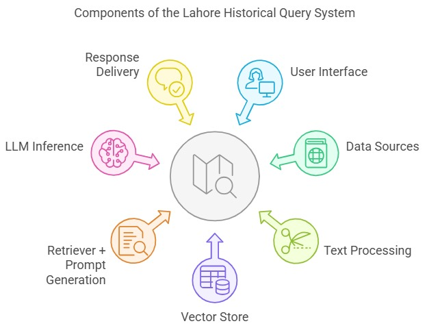

# Lahore History Search App

An interactive web application that allows users to explore the rich history of Lahore. Powered by advanced language models (LLMs), Wikipedia, web, and PDF document retrieval, this app provides precise and context-aware answers to user queries.



---

## Features
- **Interactive Search**: Enter queries about Lahore's history and get detailed responses.
- **Web and PDF Integration**: Retrieves information from specified web pages and PDF documents.
- **Advanced LLM Integration**: Uses the Groq API and HuggingFace embeddings for context-aware responses.
- **Vector-Based Retrieval**: Employs FAISS for efficient document similarity search.

---

## Technologies Used

### Frameworks and Libraries:
- **[Streamlit](https://streamlit.io/)**: For creating the interactive web application.
- **[LangChain](https://docs.langchain.com/)**: For document handling, splitting, and embeddings.
- **[Groq](https://groq.com/)**: For advanced LLM querying.
- **[FAISS](https://faiss.ai/)**: For vector similarity search.
- **[HuggingFace Transformers](https://huggingface.co/transformers/)**: For embedding models.

### Data Sources:
- Wikipedia.
- Custom web pages (e.g., Lahore history websites).
- PDF documents (e.g., "History of Lahore").

---

## Requirements

### Prerequisites:
1. Python 3.8+
2. API key for Groq

### Python Libraries:
```bash
pip install streamlit langchain groq-client faiss-cpu huggingface-hub
```

---

## Installation

1. Clone the repository:
```bash
git clone https://github.com/your-username/lahore-history-search-app.git
cd lahore-history-search-app
```

2. Install the required libraries:
```bash
pip install -r requirements.txt
```

3. Add your Groq API key:
   - Update the `API_KEY` variable in the code with your valid API key.

4. Add your documents:
   - Web source: Specify a valid URL in the `WebBaseLoader`.
   - PDF source: Place your PDF file in the desired path and update the file location in the `PyPDFLoader`.

---

## Usage

1. Run the app:
```bash
streamlit run app.py
```

2. Access the app in your browser at `http://localhost:8501`.

3. Enter your query about Lahore's history and press **Get Answer**.

---

## Directory Structure
```
lahore-history-search-app/
├── app.py                # Main application script
├── requirements.txt      # List of dependencies
├── README.md             # Documentation
└── data/
    ├── lahore.pdf        # PDF source file
    └── ...
```

---

## Examples
### Input:
"Who built the Badshahi Mosque?"

### Output:
"The Badshahi Mosque in Lahore was commissioned by Emperor Aurangzeb in 1671 and completed in 1673."

---

## Contribution
Contributions are welcome! Please create a fork, make your changes, and submit a pull request.

---

## License
This project is licensed under the MIT License. See the LICENSE file for details.

---

## Acknowledgments
- [Streamlit Documentation](https://docs.streamlit.io/)
- [LangChain Documentation](https://docs.langchain.com/)
- [Groq API](https://groq.com/)

---

**Happy Exploring!**
